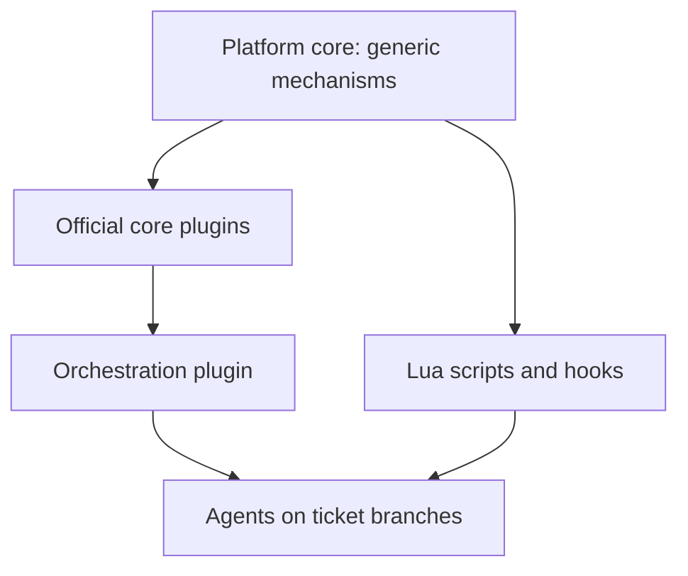

# Architecture

Placeholder page (the full architecture write-up lands with the docs tickets). The three layers:

```mermaid
flowchart TD
    A[Platform core: generic mechanisms] --> B[Official core plugins]
    B --> C[Orchestration plugin]
    C --> D[Agents on ticket branches]
    A --> E[Lua scripts and hooks]
    E --> D
```

See [Plugins](Plugins.md) and [Daemon plugin API](daemon-plugin-api.md).
